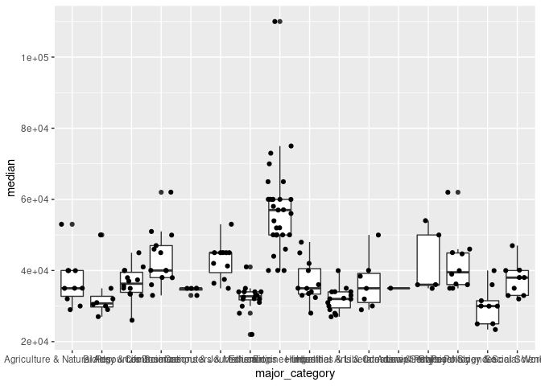

Activity 5
================
Bruce Buurstra

## Data and packages

Again, we will load all of the `{tidyverse}` for this Activity.

``` r
library(tidyverse)
```

We continue our exploration of college majors and earnings from the data
behind the FiveThirtyEight story [The Economic Guide To Picking A
College
Major](https://fivethirtyeight.com/features/the-economic-guide-to-picking-a-college-major/).
Remember that there are many considerations that go into picking a
major. Earning potential and employment prospects are two (important) of
these considerations, but they do not tell the entire story.

We read in the same data from Activity 4 below, but notice that this
code is now surrounded in parentheses.

``` r
(college_recent_grads <- read_csv("data/recent-grads.csv"))
```

    ## # A tibble: 173 x 21
    ##     rank major_code major           major_category total sample_size   men women
    ##    <dbl>      <dbl> <chr>           <chr>          <dbl>       <dbl> <dbl> <dbl>
    ##  1     1       2419 Petroleum Engi… Engineering     2339          36  2057   282
    ##  2     2       2416 Mining And Min… Engineering      756           7   679    77
    ##  3     3       2415 Metallurgical … Engineering      856           3   725   131
    ##  4     4       2417 Naval Architec… Engineering     1258          16  1123   135
    ##  5     5       2405 Chemical Engin… Engineering    32260         289 21239 11021
    ##  6     6       2418 Nuclear Engine… Engineering     2573          17  2200   373
    ##  7     7       6202 Actuarial Scie… Business        3777          51  2110  1667
    ##  8     8       5001 Astronomy And … Physical Scie…  1792          10   832   960
    ##  9     9       2414 Mechanical Eng… Engineering    91227        1029 80320 10907
    ## 10    10       2408 Electrical Eng… Engineering    81527         631 65511 16016
    ## # … with 163 more rows, and 13 more variables: sharewomen <dbl>,
    ## #   employed <dbl>, employed_fulltime <dbl>, employed_parttime <dbl>,
    ## #   employed_fulltime_yearround <dbl>, unemployed <dbl>,
    ## #   unemployment_rate <dbl>, p25th <dbl>, median <dbl>, p75th <dbl>,
    ## #   college_jobs <dbl>, non_college_jobs <dbl>, low_wage_jobs <dbl>

Compare this code output to the `load_data` chunk in your knitted
Activity 4 `.md` report. What does enclosing an assignment code (i.e.,
`object_name <- r_code`) in parentheses do?

**Response**: Enclosing an assignment code in parentheses also prints
out the result from the code.

### Data Codebook

Descriptions of the variables are again provided below. Again note that
the ACS only asks [one
question](https://www.census.gov/acs/www/about/why-we-ask-each-question/sex/)
about a person’s sexual identity.

| Header                         | Description                                                                 |
|:-------------------------------|:----------------------------------------------------------------------------|
| `rank`                         | Rank by median earnings                                                     |
| `major_code`                   | Major code, FO1DP in ACS PUMS                                               |
| `major`                        | Major description                                                           |
| `major_category`               | Category of major from Carnevale et al                                      |
| `total`                        | Total number of people with major                                           |
| `sample_size`                  | Sample size (unweighted) of full-time, year-round ONLY (used for earnings)  |
| `men`                          | Male graduates                                                              |
| `women`                        | Female graduates                                                            |
| `sharewomen`                   | Women as share of total                                                     |
| `employed`                     | Number employed (ESR == 1 or 2)                                             |
| `employed_full_time`           | Employed 35 hours or more                                                   |
| `employed_part_time`           | Employed less than 35 hours                                                 |
| `employed_full_time_yearround` | Employed at least 50 weeks (WKW == 1) and at least 35 hours (WKHP &gt;= 35) |
| `unemployed`                   | Number unemployed (ESR == 3)                                                |
| `unemployment_rate`            | Unemployed / (Unemployed + Employed)                                        |
| `median`                       | Median earnings of full-time, year-round workers                            |
| `p25th`                        | 25th percentile of earnings                                                 |
| `p75th`                        | 75th percentile of earnings                                                 |
| `college_jobs`                 | Number with job requiring a college degree                                  |
| `non_college_jobs`             | Number with job not requiring a college degree                              |
| `low_wage_jobs`                | Number in low-wage service jobs                                             |

The questions we will answer in this activity are:

-   How do the distributions of median income compare across major
    categories?
-   Do women tend to choose majors with lower or higher earnings?

## Analysis

### Median Earnings Description

### Median … Median Earnings

For the rest of this semester, I will no longer provide you with R code
chunks. Have no fear! There are a number of ways to create a code chunk:

-   Tired: Copy-and-paste a previous code chunk, delete the code, then
    add your new code
-   Wired: Click on the 
    and select  (notice all
    the different types of code chunks that you can use within an
    RMarkdown file!)
-   Inspired: Ctrl/Command + Alt/Option + I

Below, create a code chunk and name it `median_earnings`. Make sure
there is an empty line above and below the code chunk.

``` r
(median_all_majors <- college_recent_grads %>%
  summarise(median_all_majors = median(median)))
```

    ## # A tibble: 1 x 1
    ##   median_all_majors
    ##               <dbl>
    ## 1             36000

In your newly created R code chunk, verify that the median income for
all majors was $36,000. Using the `college_recent_grads` dataset and
functions from `{dplyr}`, verify the *median* summary statistic for the
variable median earnings of full-time, year-round workers (`median`).
Name this numerical summary `median_all_majors`.

 **Planned Pause Point**: If you have any
questions, contact your instructor. Otherwise feel free to continue on.

### Additional Summaries of Median Earnings

Often we would like more information than the median to help us to
better understand the distribution of a variable. Using the
`college_recent_grads` dataset and functions from `{dplyr}`, obtain the
sample size (i.e., *n*umber of observations), *mean*, *s*tandard
*d*eviation, *min*imum, *median*, and *max*imum summaries for the
variable `median` earnings of full-time, year-round workers. Be careful
when you name your output summaries as we are dealing with things that
could use the same name (i.e., “median”). When I and obtaining numerical
summaries for variables, I like to include the variable name in my
summary name (e.g., `mean_med_earnings = mean(median)`). Create a code
chunk and name it `summary_earnings`.

``` r
(college_recent_grads %>%
  summarise(number_of_obs = n(), mean_med_earnings = mean(median), stand_dev_med = sd(median), median_all_majors = median(median), max_med_earning = max(median), min_med_earning = min(median)))
```

    ## # A tibble: 1 x 6
    ##   number_of_obs mean_med_earnings stand_dev_med median_all_majo… max_med_earning
    ##           <int>             <dbl>         <dbl>            <dbl>           <dbl>
    ## 1           173            40151.        11470.            36000          110000
    ## # … with 1 more variable: min_med_earning <dbl>

Provide a discussion on what you believe the distribution of median
earnings will look like. You should discuss the center, spread, and
potential shape only using these values - I do NOT want to see any data
visualizations here.

**Response**: The distribution appears it will be right skewed, since
the mean is larger than the median and we have earnings that are much
larger than the median such as the maximum whereas our minimum earning
is much closer to the median, most of the points will be around the
center where the median and mean are.

### Median Earnings by Major Category

Now we will see how the different major categories compare to the
overall distribution of median earnings. Using the
`college_recent_grads` dataset and functions from `{dplyr}`, obtain
similar summaries of the variable `median` earnings of full-time,
year-round workers as your `summary_earnings` code chunk, *by* for each
`major_category`. *Arrange* this summary table by the median earning.
Create a code chunk and name it `major_earnings`.

``` r
(college_recent_grads %>%
  group_by(major_category)%>%
  summarise(number_of_obs = n(), mean_med_earnings = mean(median), stand_dev_med = sd(median), median_all_majors = median(median), max_med_earning = max(median), min_med_earning = min(median))%>%
   arrange(median_all_majors)%>%
   knitr::kable())
```

| major\_category                     | number\_of\_obs | mean\_med\_earnings | stand\_dev\_med | median\_all\_majors | max\_med\_earning | min\_med\_earning |
|:------------------------------------|----------------:|--------------------:|----------------:|--------------------:|------------------:|------------------:|
| Psychology & Social Work            |               9 |            30100.00 |        5381.914 |               30000 |             40000 |             23400 |
| Arts                                |               8 |            33062.50 |        7223.165 |               30750 |             50000 |             27000 |
| Humanities & Liberal Arts           |              15 |            31913.33 |        3393.032 |               32000 |             40000 |             27000 |
| Education                           |              16 |            32350.00 |        3892.728 |               32750 |             41000 |             22000 |
| Agriculture & Natural Resources     |              10 |            36900.00 |        6935.416 |               35000 |             53000 |             29000 |
| Communications & Journalism         |               4 |            34500.00 |        1000.000 |               35000 |             35000 |             33000 |
| Health                              |              12 |            36825.00 |        5776.461 |               35000 |             48000 |             28000 |
| Industrial Arts & Consumer Services |               7 |            36342.86 |        7290.829 |               35000 |             50000 |             29000 |
| Interdisciplinary                   |               1 |            35000.00 |              NA |               35000 |             35000 |             35000 |
| Law & Public Policy                 |               5 |            42200.00 |        9066.422 |               36000 |             54000 |             35000 |
| Biology & Life Science              |              14 |            36421.43 |        4528.912 |               36300 |             45000 |             26000 |
| Social Science                      |               9 |            37344.44 |        4750.556 |               38000 |             47000 |             32000 |
| Physical Sciences                   |              10 |            41890.00 |        8251.660 |               39500 |             62000 |             35000 |
| Business                            |              13 |            43538.46 |        7774.053 |               40000 |             62000 |             33000 |
| Computers & Mathematics             |              11 |            42745.45 |        5108.691 |               45000 |             53000 |             35000 |
| Engineering                         |              29 |            57382.76 |       13626.080 |               57000 |            110000 |             40000 |

Provide a discussion on how each major compares to the overall
distribution. You should discuss the center, spread, and potential shape
only using these summary values - I do NOT want to see any data
visualizations here.

**Response**: The medians of the majors pretty much all range from
30,000 to 40,000, theres 2 above 4000. There is a minimum as low as
23,000 but most fall pretty close to the median. There are a few
maximums around 50,000-60,000 and the maximum of 110,000 which still
leads me to believe the overall distribution will be at least slightly
right skewed.

Before we continue, add the following to the end of your pipeline (you
will need to pipe first) in your `major_earnings` code chunk:

    knitr::kable()

Knit your document with and without this last piped code. What changes
about the output? When would this `knitr::kable` code be useful?

**Response**: Adding this code prints a nice table for the data where
without it, it prints out the basic R code output when calling a tibble.

 **Planned Pause Point**: If you have any
questions, contact your instructor. Otherwise feel free to continue on.

### Visualize Median Earnings by Major Category

Let us see how well your descriptions in the [Median Earnings by Major
Category](#median-earnings-by-major-category) section compare to the
actual distributions. Plot the distribution of the variable `median`
earnings of full-time, year-round workers for each `major_category`
using the *boxplot* and *jitter* geometries. Create a code chunk and
name it `major_boxplot`.

``` r
ggplot(college_recent_grads, aes(x = major_category, y = median))+
  geom_boxplot()+
  geom_jitter()
```

<!-- -->

Provide a discussion on how your descriptions in the Median Earnings by
Major Category section compares.

**Response**: It does appear that a lot of the data lies right around
the overall median of 36,000 and there do appear to be points more
spaced out above the median so I still believe the overall distribution
will be slightly right skewed.

### Multiple Rankings

#### Ranking by `major_category`

The current rankings provided in the data are by `major`. Here we will
develop a series of rankings to see how the `major_category` levels
perform. Create a code chunk and name it `category_rankings`. In this
code chunk,

1.  Group `college_recent_grads` by `major_category`
2.  Summarize the variable `total` as the *sum* across all majors (to
    get the total number of majors within a `major_category`) and the
    following variables by their *median* value: `sharewomen`,
    `unemployment_rate`, and `median` earnings. Provide a meaningful
    name to each summarized value.
3.  Assign/create a *rank* for each summarized value (rank for `total`,
    rank for `sharewomen`, etc.) and provide a meaningful name to each
    ranked column value.
4.  Arrange the results so that `major_category` appear in alphabetical
    order (“A” at the top).

``` r
college_recent_grads%>%
  group_by(major_category)%>%
  summarise(total_majors = n_distinct(major), med_share_women = median(sharewomen), med_unem_rate = median(unemployment_rate), med_med_earnings = median(median))%>%
  mutate(rank_share_women = rank(med_share_women), rank_total = rank(total_majors))%>%
  arrange(major_category)
```

    ## # A tibble: 16 x 7
    ##    major_category    total_majors med_share_women med_unem_rate med_med_earnings
    ##    <chr>                    <int>           <dbl>         <dbl>            <dbl>
    ##  1 Agriculture & Na…           10          NA            0.0553            35000
    ##  2 Arts                         8           0.667        0.0895            30750
    ##  3 Biology & Life S…           14           0.583        0.0680            36300
    ##  4 Business                    13           0.441        0.0697            40000
    ##  5 Communications &…            4           0.672        0.0722            35000
    ##  6 Computers & Math…           11           0.269        0.0908            45000
    ##  7 Education                   16           0.769        0.0488            32750
    ##  8 Engineering                 29           0.227        0.0598            57000
    ##  9 Health                      12           0.783        0.0643            35000
    ## 10 Humanities & Lib…           15           0.690        0.0817            32000
    ## 11 Industrial Arts …            7           0.232        0.0557            35000
    ## 12 Interdisciplinary            1           0.771        0.0709            35000
    ## 13 Law & Public Pol…            5           0.476        0.0825            36000
    ## 14 Physical Sciences           10           0.520        0.0511            39500
    ## 15 Psychology & Soc…            9           0.799        0.0651            30000
    ## 16 Social Science               9           0.543        0.0972            38000
    ## # … with 2 more variables: rank_share_women <dbl>, rank_total <dbl>

Provide a discussion on how the `major_category` rankings compare.

**Response**:

 **(Final) Planned Pause Point**: If you
have any questions, contact your instructor. Otherwise feel free to
continue on.

Knit, then stage everything listed in your **Git** pane, commit (with a
meaningful commit message), and push to your GitHub repo. Go to GitHub
and verify that your `activity04-data-pieplines.Rmd` file appears as you
intended it to.

You can now go back to the `README` file.

## Attribution

This activity is inspired by a lab from [Dr. Mine
Çetinkaya-Rundel](http://www2.stat.duke.edu/~mc301/)’s STA 199 course.
